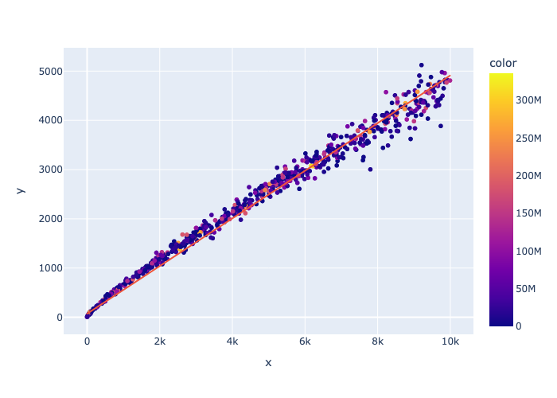

# Jitter

Take
$$J_s = \sum_k{\mathbin{sgn}(J_{k+1}-J_k)}$$

as a measure of "jitter", which for positive could mean time is moving forward.

## Simulation

See in `../circle`, `circle.py`

## Analysis

Analysis is a bit too strong a word. But it looks like at sensitivity approximately equal to 1/2 average density is where jitter is strongest.

